# **BAB 2: CRUD MongoDB**
**Oleh Ghifari Adil Ruchiyat - 215150701111003**

## MongoDB Compass
1. Lakukan koneksi ke MongoDB menggunakan connection string
   
   

      </img>
   

2. Buat database dengan melakukan klik “Create Database”
   
   

      </img>
   

3. Lakukan insert buku pertama dengan melakukan klik "Add Data", pilih "Insert Document", isi dengan data yang diinginkan dan klik "Insert"
   
   

      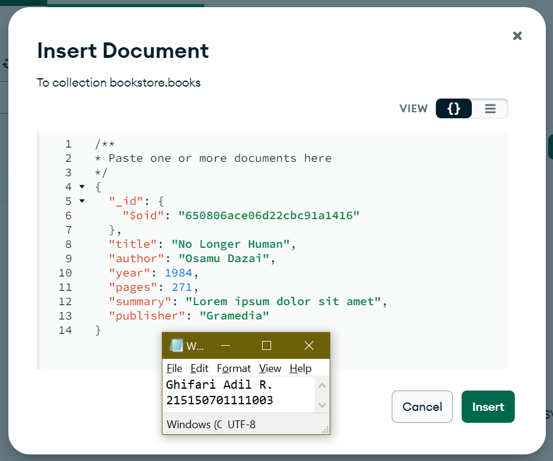</img>
   

4. Lakukan insert buku kedua dengan cara yang sama.

   

      </img>
   

5. Lakukan pencarian buku dengan author "Osamu Dazai" dengan mengisi filter yang diinginkan dan klik "Find"

   

      </img>
   

6. Lakukan perubahan summary pada buku "No Longer Human" menjadi "Buku yang bagus (\<NAMA\>,\<NIM\>) dengan melakukan klik "Edit Document" (berlambang pensil), mengisi nilai summary yang baru, dan melakukan klik "Update"

   

      </img>
   

7. Lakukan penghapusan pada buku "I Am a Cat" dengan melakukan klik "Remove Document" (berlambang tong sampah) dan melakukan klik "Delete"

   

      </img>
   

## MongoDB Shell
1. Lakukan koneksi ke MongoDB Server dengan menjalankan command `mongosh` bagi yang menggunakan terminal build in OS sehingga tampilan terminal kalian akan menjadi seperti berikut
   
   

      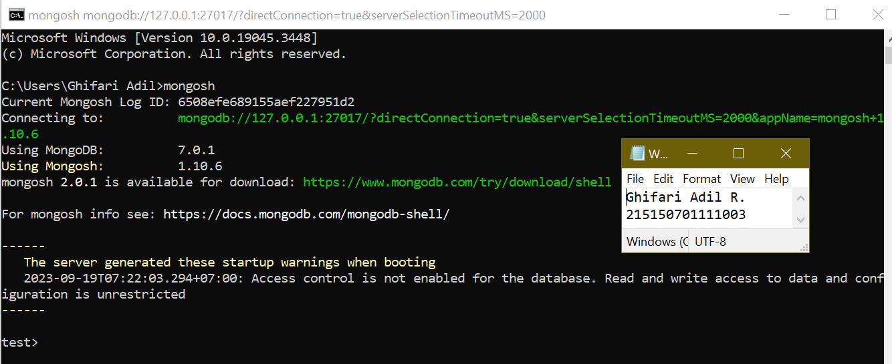</img>
   

2. Mencoba melihat list database yang ada di server dengan menjalankan command `show dbs`
   
   

      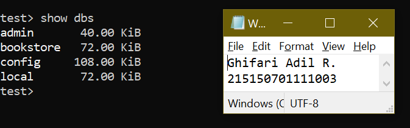</img>
   

   Untuk berpindah ke database "bookstore" gunakan command use bookstore, kalian dapat memastikan telah berpindah ke database yang benar dengan melihat tulisan sebelum tanda ">"

   

      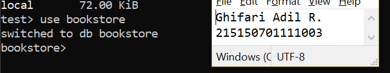</img>
   

   Cobalah untuk melihat collection yang ada pada database tersebut dengan menggunakan command `show collections`

   

      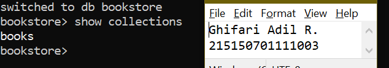</img>
   

3. Lakukan insert buku "Overlord I" dengan menggunakan command `db.books.insertOne(<data kalian>)`, setelah insert buku berhasil maka MongoDB akan mengembalikan pesan sebagai berikut.
   
   

      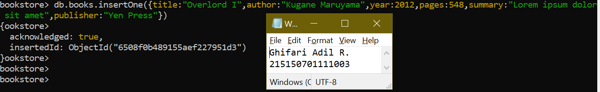</img>
   

4. Lakukan insert buku "The Setting Sun" dan "Hujan" dengan insert many dengan menggunakan command `db.books.insertMany(<data kalian>)`, dan akan mengembalikan pesan sebagai berikut.
   
   

      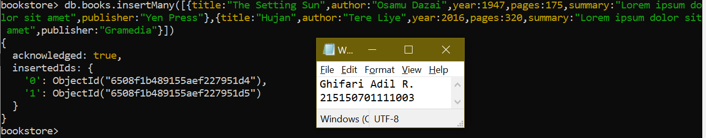</img>
   

5. Lakukan pencarian buku dengan menggunakan command `db.books.find()` untuk melakukan pencarian semua buku.
   
   

      </img>
   

6. Tampilkan seluruh buku dengan author "Osamu Dazai" dengan mengisi argument pada find() dengan menggunakan command `db.books.find({<filter yang ingin diisi>})`
   
   

      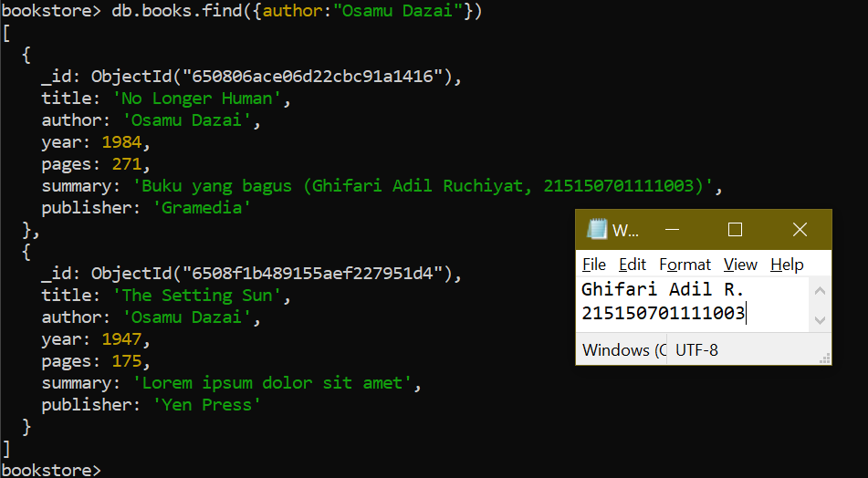</img>
   

7. Lakukan perubahan summary pada buku "Hujan" menjadi "Buku yang bagus (\<NAMA\>,\<NIM\>)" dengan mengunakan command `db.books.updateOne({<filter>}, {$set: {<data yang akan di update>}})` sehingga output yang dihasilkan oleh MongoDB akan menjadi seperti berikut
   
   

      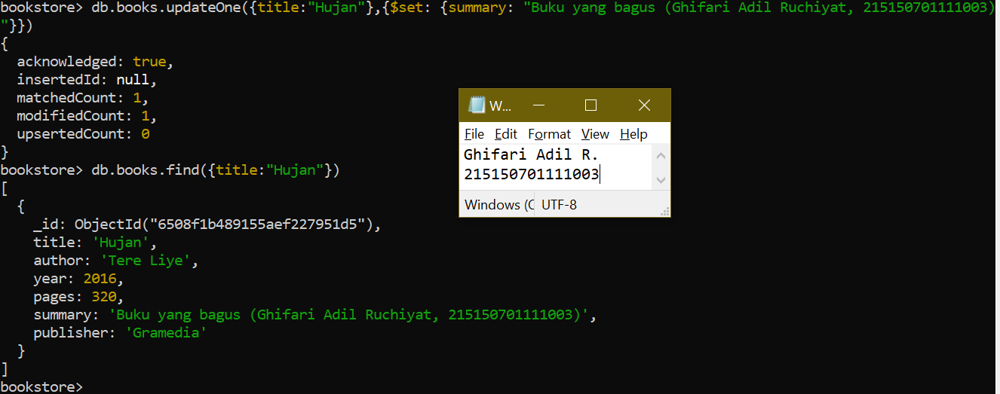</img>
   

8. Lakukan perubahan publisher menjadi "Yen Press: pada semua buku "Osamu Dazai" dengan menggunakan command `db.books.updateMany({<filter>}, {$set: {<data yang akan di update>}})`
   
   

      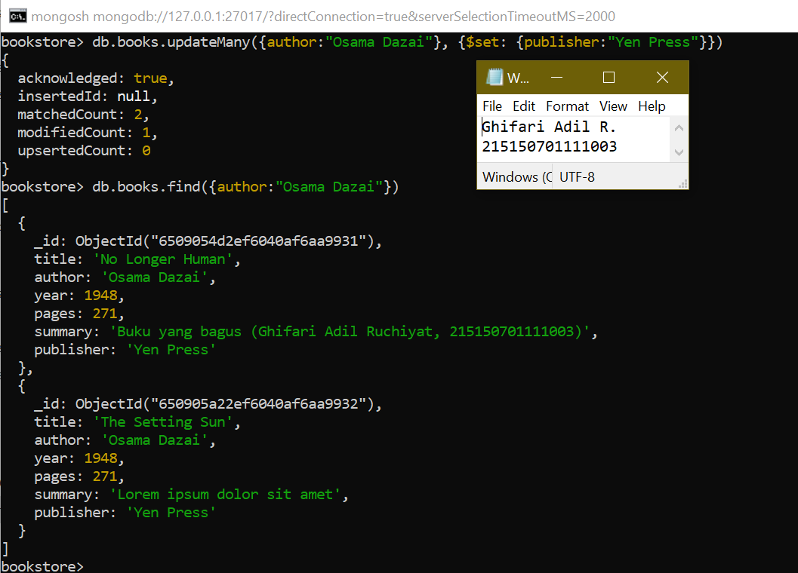</img>
   

9. Lakukan penghapusan pada buku "Overlord I" dengan menggunakan command `db.books.deleteOne({<argument>})`
   
   

      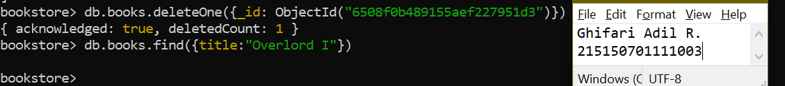</img>
   

10. Lakukan penghapusan pada semua buku “Osamu Dazai dengan menggunakan command `db.books.deleteMany({<argument>})`
    
    

      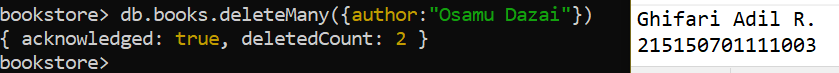</img>
   

