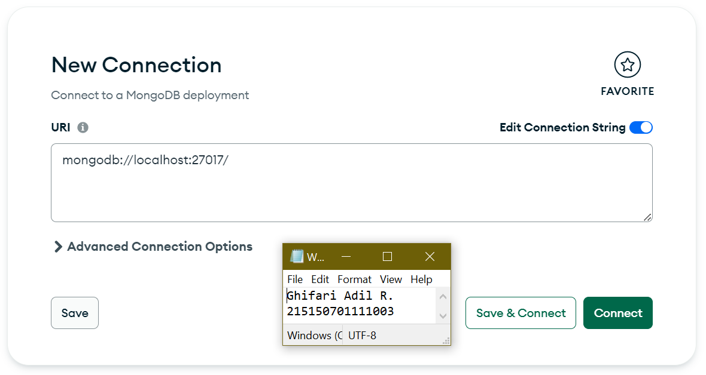
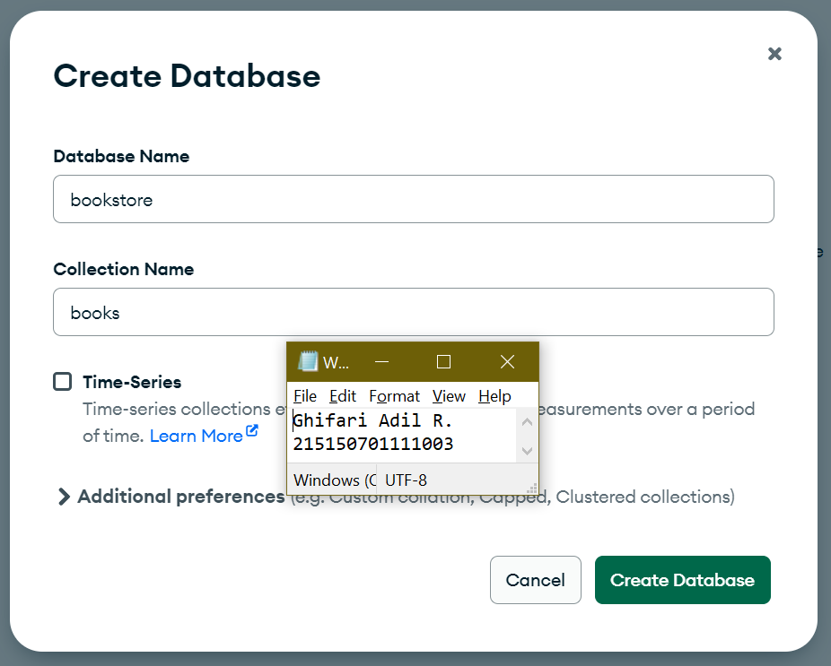
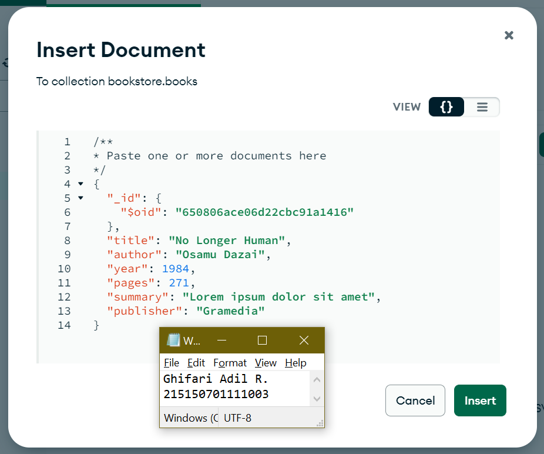
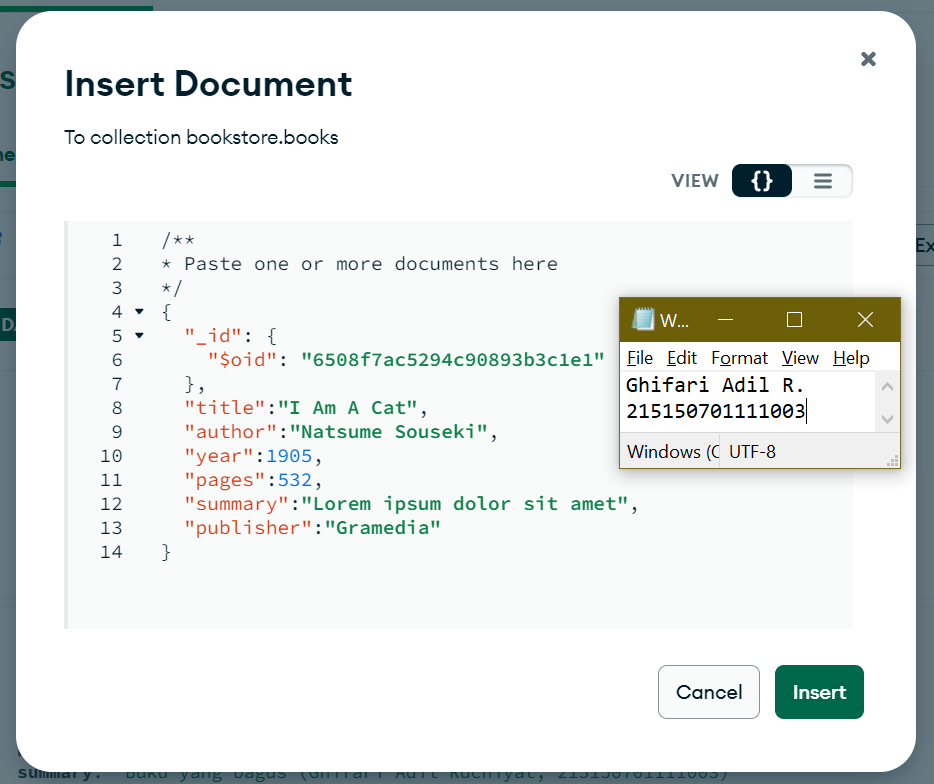
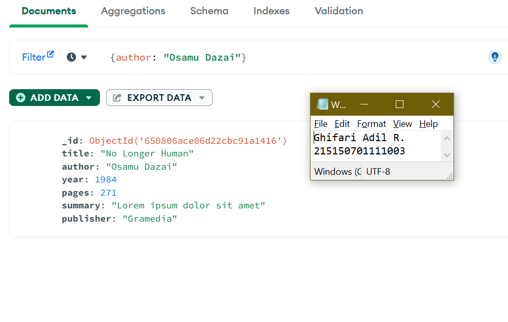
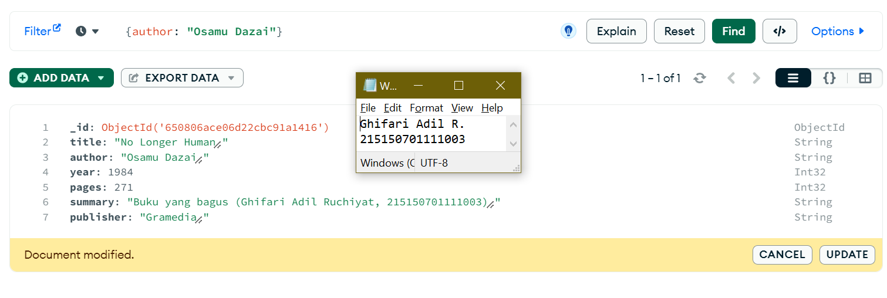
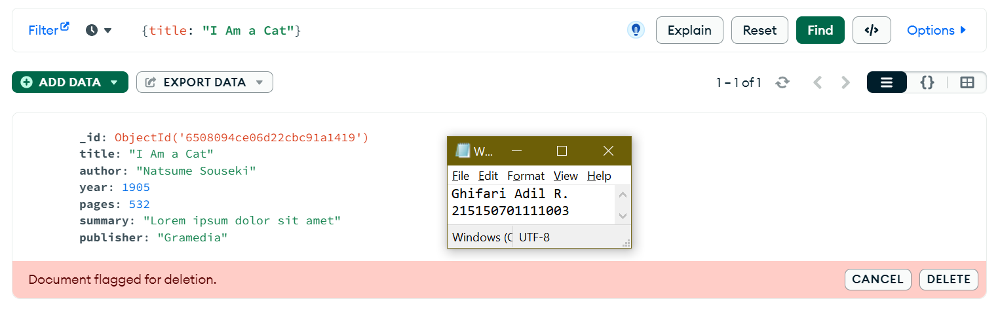

# **BAB 2: CRUD MongoDB**
**Oleh Ghifari Adil Ruchiyat - 215150701111003**

## MongoDB Compass
1. Lakukan koneksi ke MongoDB menggunakan connection string
   
   </img>

2. Buat database dengan melakukan klik “Create Database”
   
   
</img>

3. Lakukan insert buku pertama dengan melakukan klik "Add Data", pilih "Insert Document", isi dengan data yang diinginkan dan klik "Insert"
   
   
</img>

4. Lakukan insert buku kedua dengan cara yang sama.

   
</img>

5. Lakukan pencarian buku dengan author "Osamu Dazai" dengan mengisi filter yang diinginkan dan klik "Find"

   
</img>

6. Lakukan perubahan summary pada buku "No Longer Human" menjadi "Buku yang bagus (\<NAMA\>,\<NIM\>) dengan melakukan klik "Edit Document" (berlambang pensil), mengisi nilai summary yang baru, dan melakukan klik "Update"

   
</img>

7. Lakukan penghapusan pada buku "I Am a Cat" dengan melakukan klik "Remove Document" (berlambang tong sampah) dan melakukan klik "Delete"

   
</img>

## MongoDB Shell
1.