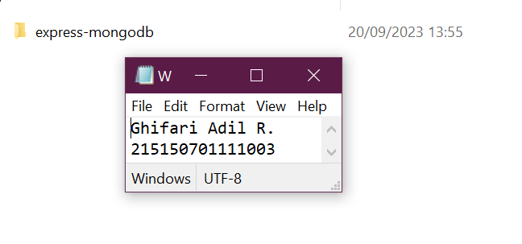
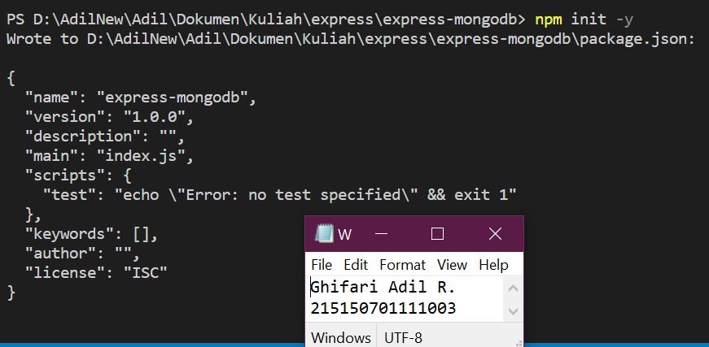
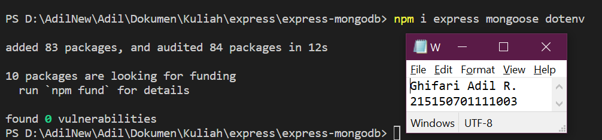
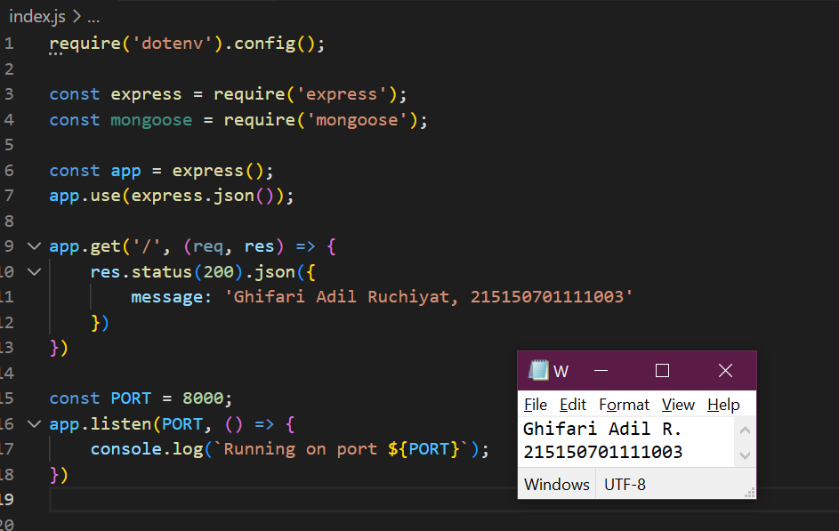
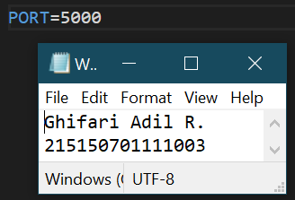
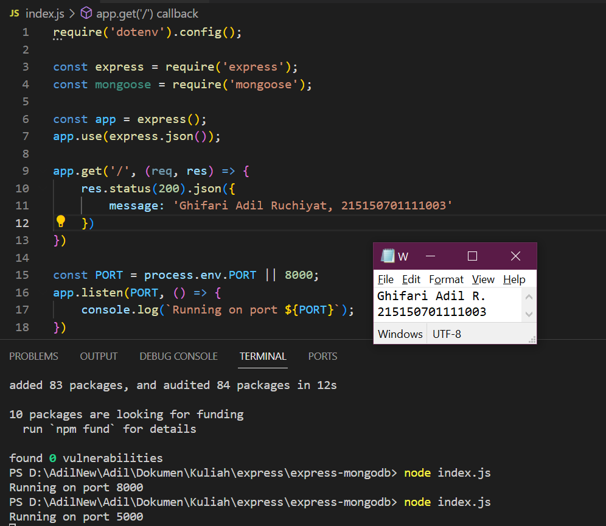
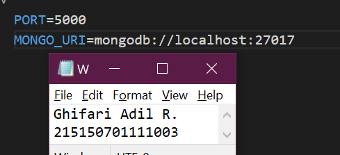
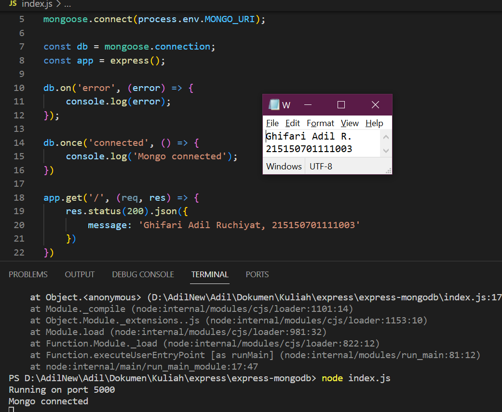

# **BAB 3: Integrasi MongoDB dan Express**
**Oleh Ghifari Adil Ruchiyat - 215150701111003**

## Percobaan instalasi NodeJS
1. Buka halaman https://nodejs.org/en

2. Download dan jalankan node setup

3. Setelah instalasi selesai jalankan command `node -v` untuk memeriksa apakah NodeJS sudah terinstall
   <p align="center">
      </img><br>
      <i>Gambar 1.1: Hasil command <code>node -v</code> </i>
   </p>

---------------
## Inisiasi project Express dan pemasangan package
1. Lakukan pembuatan folder dengan nama express-mongodb dan masuk ke dalam folder tersebut lalu buka melalui text editor masing-masing
   <p align="center">
      </img><br>
      <i>Gambar 2.1: Membuat folder express-mongodb</i>
   </p>

2. Lakukan npm init untuk mengenerate file package.json dengan menggunakan command `npm init -y`
   <p align="center">
      </img><br>
      <i>Gambar 2.2: Menjalankan command <code>npm init -y</code> </i>
   </p>

3. Lakukan instalasi express, mongoose, dan dotenv dengan menggunakan command `npm i express mongoose dotenv`
   <p align="center">
      </img><br>
      <i>Gambar 2.3: Menginstall express, mongoose, dan dotenv</i>
   </p>

## Koneksi Express ke MongoDB
1. Buatlah file index.js pada root folder dan masukkan kode di bawah ini
   
   ```javascript
   require('dotenv').config();
   const express = require('express');
   const mongoose = require('mongoose');

   const app = express();

   app.use(express.json());
   app.get('/', (req, res) => {
      res.status(200).json({
         message: '<nama>,<nim>'
      })
   })

   const PORT = 8000;
   app.listen(PORT, () => {
      console.log(`Running on port ${PORT}`);
   })
   ```
   
   Setelah itu coba jalankan aplikasi dengan command `node index.js`
   <p align="center">
      </img><br>
      <i>Gambar 3.1: Menambahkan kode ke index.js, lalu menjalankannya</i>
   </p>

2. Lakukan pembuatan file .env dan masukkan baris berikut

       PORT=5000
   
   <p align="center">
      </img><br>
      <i>Gambar 3.2: Menambahkan file .env dan menambahkan nomor port</i>
   </p>

   Setelah itu ubahlah kode pada listening port menjadi berikut dan coba jalankan aplikasi kembali

   ```javascript
   ...
   const PORT = process.env.PORT || 8000;
   app.listen(PORT, () => {
      console.log(`Running on port ${PORT}`);
   })
   ```

   <p align="center">
      </img><br>
      <i>Gambar 3.3: Menggunakan file .env untuk nomor port</i>
   </p>

3. Copy connection string yang terdapat pada compas atau atlas dan paste kan pada .env seperti berikut

       MONGO_URI=<Connection string masing-masing>

   <p align="center">
      </img><br>
      <i>Gambar 3.4: Menambahkan connection string pada file .env</i>
   </p>

4. Tambahkan baris kode berikut pada file index.js

   ```javascript
   require('dotenv').config();
   const express = require('express');
   const mongoose = require('mongoose');
   
   mongoose.connect(process.env.MONGO_URI);
   const db = mongoose.connection;
   
   db.on('error', (error) => {
   console.log(error);
   });
   
   db.once('connected', () => {
   console.log('Mongo connected');
   })

   ...
   ```
   
   Setelah itu coba jalankan aplikasi kembali

   <p align="center">
      </img><br>
      <i>Gambar 3.5: Menambahkan kode untuk koneksi ke database mongoDB</i>
   </p>