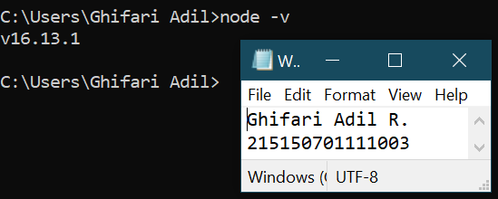

# **BAB 3: Integrasi MongoDB dan Express**
**Oleh Ghifari Adil Ruchiyat - 215150701111003**

## Percobaan instalasi NodeJS
1. Buka halaman 
2. Download dan jalankan node setup
3. Setelah instalasi selesai jalankan command node -v untuk memeriksa apakah NodeJS sudah terinstall
   

      </img>
   
