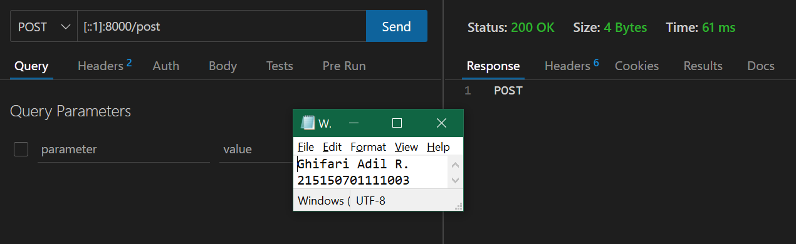

# **BAB 4: Basic Routing dan Migration**
**Oleh Ghifari Adil Ruchiyat - 215150701111003**

1. **GET**

   Untuk menambahkan endpoint dengan method GET pada aplikasi kita, kita dapat mengunjungi file web.php pada folder routes. Kemudian tambahkan baris ini pada akhir file

   ```php
    ...
    $router->get('/get', function () {
        return 'GET';
    });
   ```
   <p align="center">
      </img><br>
      <i>Gambar 1.1: Menambahkan kode pada file web.php untuk route /get</i>
   </p>

   Setelah itu coba jalankan aplikasi dengan command

   ```powershell
   php -S localhost:8000 -t public
   ```

   > Note: Pastikan buka cmd pada folder aplikasi

   <p align="center">
      </img><br>
      <i>Gambar 1.2: Menjalankan aplikasi lewat cmd</i>
   </p>

   Setelah aplikasi berhasil dijalankan, kita dapat membuka browser dengan url, http://localhost:8000/get, path yang akan kita akses akan berbentuk demikian, http://{BASE_URL}{PATH}, jika BASE_URL kita adalah localhost:8000 dan PATH kita adalah /get, maka url akan berbentuk seperti diatas.
   
   <p align="center">
      </img><br>
      <i>Gambar 1.3: Membuka aplikasi dari browser dengan url</i>
   </p>

2. **POST, PUT, PATCH, DELETE, dan OPTIONS**

    Sama halnya saat menambahkan method GET, kita dapat menambahkan method POST, PUT, PATCH, DELETE, dan OPTIONS pada file web.php dengan code seperti ini

    ```php
    ...
    $router->post('/post', function () {
        return 'POST';
    });
    $router->put('/put', function () {
        return 'PUT';
    });
    $router->patch('/patch', function () {
        return 'PATCH';
    });
    $router->delete('/delete', function () {
        return 'DELETE';
    });
    $router->options('/options', function () {
        return 'OPTIONS';
    });
    ```

    <p align="center">
       </img><br>
       <i>Gambar 1.4: Menambahkan route /post, /put, /patch, /delete, dan /options</i>
    </p>

    Setelah selesai menambahkan route untuk method POST, PUT, PATCH, DELETE, dan OPTIONS, kita dapat menjalankan server seperti pada saat percobaan GET. Setelah server berhasil menyala, kita dapat membuka aplikasi Postman atau Insomnia atau kita juga dapat menggunakan PowerShell (Windows) / Terminal (Linux atau Mac) untuk melakukan request ke server. Namun, pada percobaan kali ini kita akan menggunakan extensions pada VSCode yaitu Thunder Client.

    1. Kita dapat menginstall ekstensi dengan membuka panel extensions lalu mencari thunder client
       
        <p align="center">
           </img><br>
           <i>Gambar 1.5: Thunder client pada VSCode</i>
        </p>
    
    2. Setelah menginstall Thunder Client, kita akan melihat logo seperti petir pada activity bar kita (sebelah kiri).

        <p align="center">
           </img><br>
           <i>Gambar 1.6: Logo thunder client activity bar di VSCode</i>
        </p>
    
    3. Kita dapat membuat request dengan menekan "New Request" pada ekstensi

        <p align="center">
           </img><br>
           <i>Gambar 1.7: Tampilan awal extension thunder client</i>
        </p>
    
    4. Setelah itu kita dapat memasukkan method dan url yang dituju

        <p align="center">
           </img><br>
           <i>Gambar 1.8: Memasukkan method dan url yang dituju pada thunder client</i>
        </p>
    
    5. Akses url yang baru saja ditambahkan pada aplikasi dengan methodnya

        <p align="center">
           </img><br>
           <i>Gambar 1.9: Mengakses salah satu endpoint aplikasi menggunakan thunder client</i>
        </p>

3. Migrasi Database
    1. Sebelum melakukan migrasi database pastikan server database aktif kemudian pastikan sudah membuat database dengan nama `lumenapi`

        <p align="center">
           </img><br>
           <i>Gambar 1.10: Membuat database baru bernama lumenapi pada DBeaver</i>
        </p>
    
    2. Kemudian ubah konfigurasi database pada file .env menjadi seperti ini

        ```
        DB_CONNECTION=mysql
        DB_HOST=127.0.0.1
        DB_PORT=3306
        DB_DATABASE=lumenapi
        DB_USERNAME=root
        DB_PASSWORD=<<password masing-masing>>
        ```

        <p align="center">
           </img><br>
           <i>Gambar 1.11: Mengubah konfigurasi agar dapat mengakses database lumenapi</i>
        </p>

    3. Setelah mengubah konfigurasi pada file .env, kita juga perlu menghidupkan beberapa library bawaan dari lumen dengan membuka file app.php pada folder bootstrap dan mengubah baris ini

        ```php
        //$app->withFacades();
        //$app->withEloquent();
        ```
        
        Menjadi,
        
        ```php
        $app->withFacades();
        $app->withEloquent();
        ```

        <p align="center">
           </img><br>
           <i>Gambar 1.12: Mengubah kode pada file app.php agar dapat menggunakan facade dan eloquent</i>
        </p>
    
    4. Setelah itu jalankan command berikut untuk membuat file migration

        ```powershell
        php artisan make:migration create_users_table # membuat migrasi untuk tabel users
        php artisan make:migration create_products_table # membuat migrasi untuk tabel products
        ```

        <p align="center">
           </img><br>
           <i>Gambar 1.13: Membuat migration baru</i>
        </p>

        Setelah menjalankan 2 syntax diatas akan terbuat 2 file pada folder database/migrations dengan format YYYY_MM_DD_HHmmss_nama_migrasi. Pada file migrasi kita akan menemukan fungsi up() dan fungsi down(), fungsi up() akan digunakan pada saat kita melakukan migrasi, fungsi down() akan digunakan saat kita ingin me-rollback migrasi

        <p align="center">
           </img><br>
           <i>Gambar 1.14: File migration baru yang telah dibuat</i>
        </p>
    
    5. Ubah fungsi up pada file migrasi `create_users_table`

        ```php
        # sebelumnya
        ...
        public function up()
        {
            Schema::create('users', function (Blueprint $table) {
                $table->id();
                $table->timestamps();
            });
        }
        ...
        # diubah menjadi
        ...
        public function up()
        {
            Schema::create('users', function (Blueprint $table) {
                $table->id();
                $table->timestamps();
                $table->string('name');
                $table->string('email');
                $table->string('password');
            });
        }
        ...
        ```

        <p align="center">
           </img><br>
           <i>Gambar 1.15: Mengubah method up pada migrasi <code>create_users_table</code> </i>
        </p>
    
    6. Ubah fungsi up pada file migrasi `create_products_table`

        ```php
        # sebelumnya
        ...
        public function up()
        {
            Schema::create('products', function (Blueprint $table) {
                $table->id();
                $table->timestamps();
            });
        }
        ...
        # diubah menjadi
        ...
        public function up()
        {
            Schema::create('products', function (Blueprint $table) {
                $table->id();
                $table->timestamps();
                $table->string('name');
                $table->integer('category_id');
                $table->string('slug');
                $table->integer('price');
                $table->integer('weight');
                $table->text('description');
            });
        }
        ...
        ```
        <p align="center">
           </img><br>
           <i>Gambar 1.16: Mengubah method up pada migrasi <code>create_products_table</code> </i>
        </p>

    7. Kemudian jalankan command

        ```powershell
        php artisan migrate
        ```
         <p align="center">
           </img><br>
           <i>Gambar 1.17: Melakukan migration database</i>
        </p>

