# **BAB 5: Dynamic Route dan Middleware**
**Oleh Ghifari Adil Ruchiyat - 215150701111003**

1. **Dynamic Route**

    Dynamic route adalah route yang dapat berubah-ubah, contohnya pada saat kita membuka suatu halaman web, kadang kita melihat `/users/1` atau `/users/2` , hal ini yang dinamakan dynamic routes.
    
    Untuk menambahkan dynamic routes pada aplikasi lumen kita, kita dapat menggunakan syntax berikut,
    
    ```php
    $router->get('/user/{id}', function ($id) {
        return 'User Id = ' . $id;
    });
    ```

    <p align="center">
       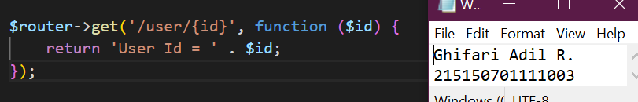</img><br>
       <i>Gambar 1.1: Contok kode dynamic route </i>
    </p>

    <p align="center">
       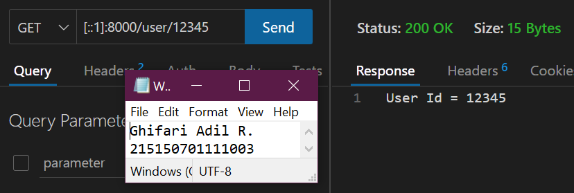</img><br>
       <i>Gambar 1.2: Hasil request menggunakan dynamic route </i>
    </p>

    Saat menambahkan parameter pada routes, kita tidak terbatas pada 1 variable saja, namun kita dapat menambahkan sebanyak yang diperlukan seperti kode berikut,

    ```php
    $router->get('/post/{postId}/comments/{commentId}', function ($postId, $commentId) {
        return 'Post ID = ' . $postId . ' Comments ID = ' . $commentId;
    });
    ```

    <p align="center">
       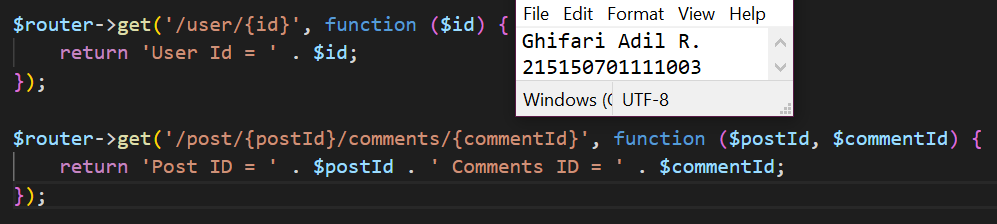</img><br>
       <i>Gambar 1.3: Contoh kode dynamic route dengan banyak parameter </i>
    </p>

    <p align="center">
       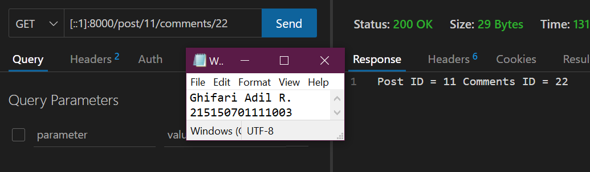</img><br>
       <i>Gambar 1.4: Hasil request menggunakan dynamic route dengan banyak parameter</i>
    </p>

    Pada dynamic routes kita juga bisa menambahkan optional routes, yang mana optional routes tidak mengharuskan kita untuk memberi variable pada endpoint kita, namun saat kita memanggil endpoint, dapat menggunakan parameter variable ataupun tidak, seperti pada kode dibawah ini,

    ```php
    $router->get('/users[/{userId}]', function ($userId = null) {
        return $userId === null ? 'Data semua users' : 'Data user dengan id ' . $userId;
    });
    ```

    <p align="center">
       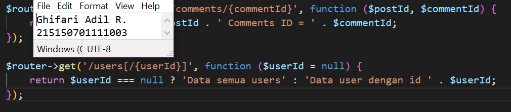</img><br>
       <i>Gambar 1.5: Contoh kode dynamic route dengan optional routes</i>
    </p>

    <p align="center">
       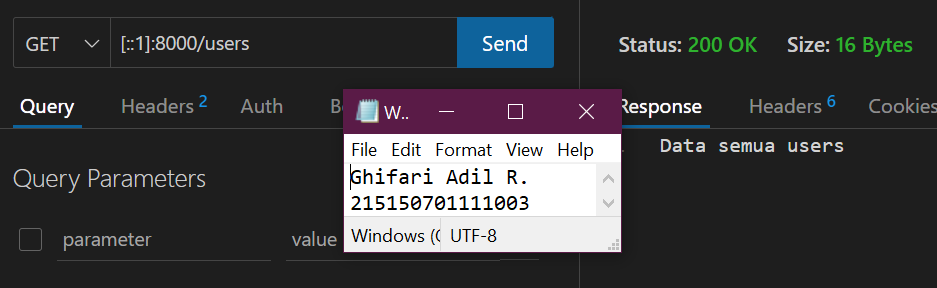</img><br>
       <i>Gambar 1.6: Hasil request endpoint <code>/users</code> menggunakan optional routes </i>
    </p>

    <p align="center">
       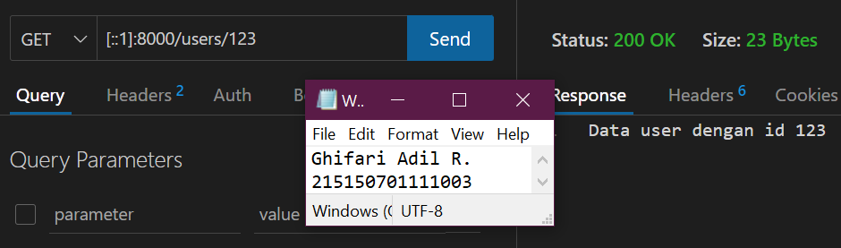</img><br>
       <i>Gambar 1.7: Hasil request endpoint <code>/users/123</code> menggunakan optional routes</i>
    </p>

2. **Aliases Route**

    Aliases Route digunakan untuk memberi nama pada route yang telah kita buat, hal ini dapat membantu kita, saat kita ingin memanggil route tersebut pada aplikasi kita. Berikut syntax untuk menambahkan aliases route

    ```php
    $router->get('/auth/login', ['as' => 'route.auth.login', function (...) {...}])
    ...
    $router->get('/profile', function (Request $request) {
        if ($request->isLoggedIn) {
            return redirect()->route('route.auth.login');
        }
    });
    ```

    <p align="center">
       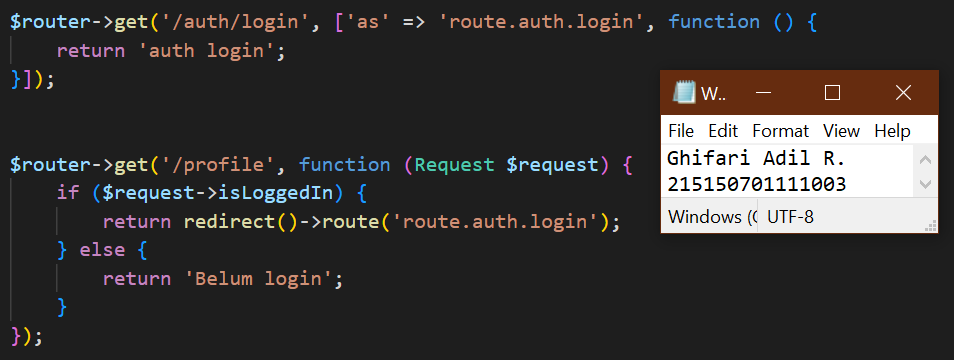</img><br>
       <i>Gambar 1.8: Contoh kode menggunakan aliases route</i>
    </p>

    <p align="center">
       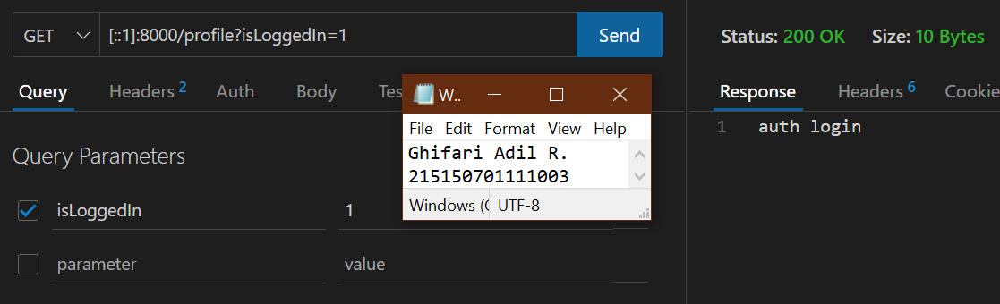</img><br>
       <i>Gambar 1.9: Hasil request menggunakan aliases route</i>
    </p>

3. **Group Route**

    Pada lumen, kita juga dapat memberikan grouping pada routes kita agar lebih mudah pada saat penulisan route pada web.php kita. Kita dapat melakukan grouping dengan menggunakan syntax berikut,

    ```php
    $router->group(['prefix' => 'users'], function () use ($router) {\
        $router->get('/', function () { // menjadi /users/, /users => prefix, / => path
            return "GET /users";
        });
    });
    ```
    <p align="center">
       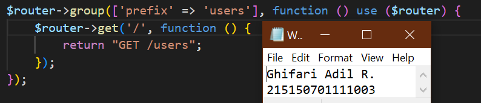</img><br>
       <i>Gambar 1.10: Contoh kode menggunakan group route</i>
    </p>

    <p align="center">
       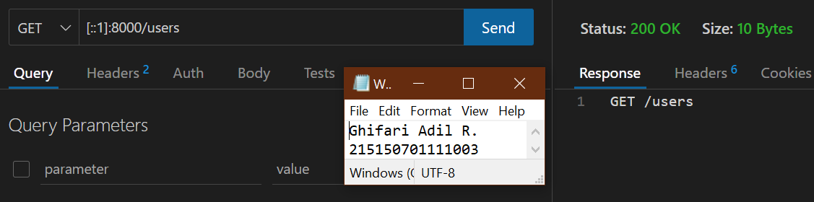</img><br>
       <i>Gambar 1.11: Hasil request setelah menambahkan group route</i>
    </p>

    Selain dapat mengelompokkan prefix, kita juga dapat mengelompokkan middleware dan namespace pada kelompok routes kita.

4. **Middleware**

    Middleware adalah penengah antara komunikasi aplikasi dan client. Middleware biasanya digunakan untuk membatasi siapa yang dapat berinteraksi dengan aplikasi kita dan semacamnya, kita dapat menambahkan middleware dengan menambahkan file pada folder `app/Http/Middleware` . Pada folder tersebut terdapat file `ExampleMiddleware `, kita dapat mencopy file tersebut untuk membuat middleware baru.

    Pada praktikum kali ini akan dibuat middleware Age dengan isi,

    ```php
    <?php

    namespace App\Http\Middleware;

    use Closure;

    class AgeMiddleware
    {
        /**
        * Handle an incoming request.
        *
        * @param \Illuminate\Http\Request $request
        * @param \Closure $next
        * @return mixed
        */
        public function handle($request, Closure $next)
        {
            if ($request->age < 17)
                return redirect('/fail');
            return $next($request);
        }
    }
    ```

    <p align="center">
       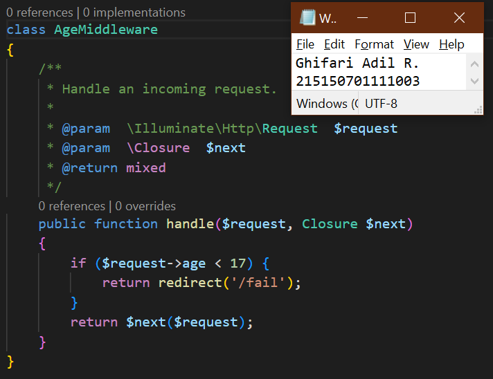</img><br>
       <i>Gambar 1.12: Membuat middleware bernama AgeMiddleware</i>
    </p>

    Kemudian, setelah menambahkan filter pada `AgeMiddleware`, kita harus mendaftarkan `AgeMiddleware` pada aplikasi kita, pada file `bootstrap/app.php` seperti berikut ini,

    ```php
    ...

    // $app->middleware([
    // App\Http\Middleware\ExampleMiddleware::class
    // ]);
    $app->routeMiddleware([
        // 'auth' => App\Http\Middleware\Authenticate::class,
        'age' => App\Http\Middleware\AgeMiddleware::class
    ]);

    ...
    ```

    Pada baris 65 terdapat comment mengenai proses mendaftarkan suatu middleware dalam aplikasi kita. Untuk menambahkan middleware pada aplikasi kita, kita dapat men-uncomment baris 75 hingga 77, kemudian menambahkan age middleware ke dalamnya.

    Namun, karena kita hanya ingin menambahkan middleware pada route tertentu, kita akan menghapus comment pada baris 79 hingga 81, kemudian menambahkan middleware age di dalamnya.

    <p align="center">
       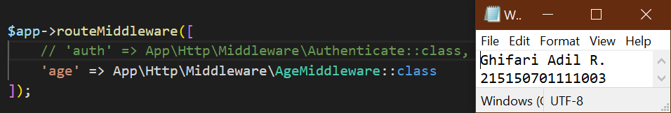</img><br>
       <i>Gambar 1.13: Menambahkan middleware pada aplikasi</i>
    </p>

    Lalu, kita dapat menambahkan middleware pada routes kita dengan menambahkan opsi middleware pada salah satu route, contohnya,

    ```php
    $router->get('/admin/home/', ['middleware' => 'age', function () {
        return 'Dewasa';
    }]);

    $router->get('/fail', function () {
        return 'Dibawah umur';
    });
    ```

    <p align="center">
       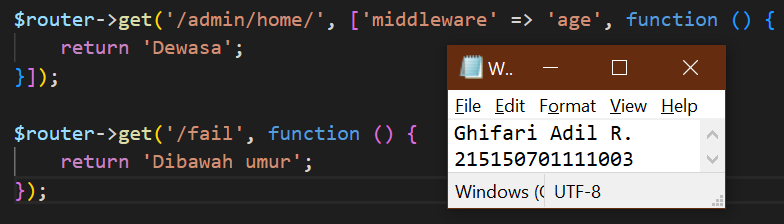</img><br>
       <i>Gambar 1.14: Contoh kode route menggunakan middleware</i>
    </p>

    <p align="center">
       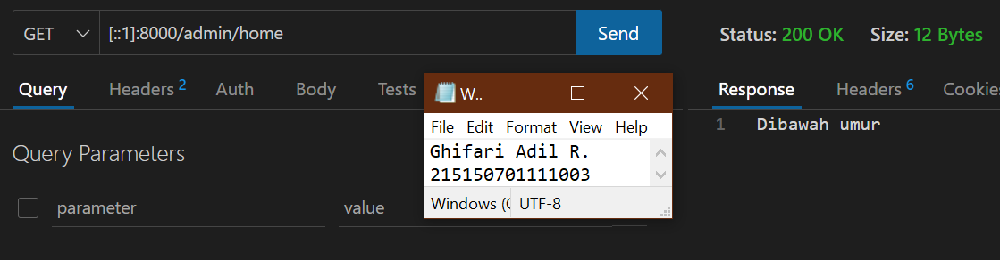</img><br>
       <i>Gambar 1.15: Mengakses endpoint <code>/admin/home</code> tanpa parameter age</i>
    </p>

    <p align="center">
       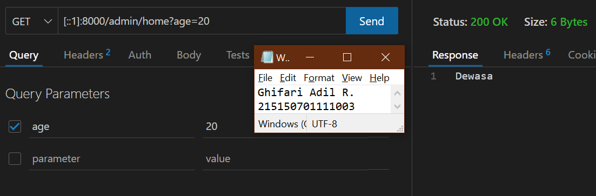</img><br>
       <i>Gambar 1.16: Mengakses endpoint <code>/admin/home</code> dengan parameter age = 20</i>
    </p>