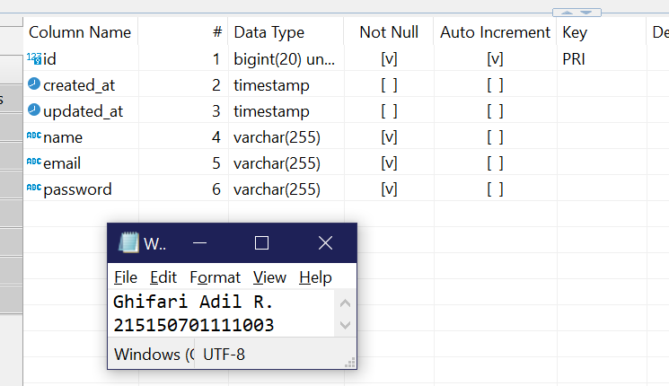
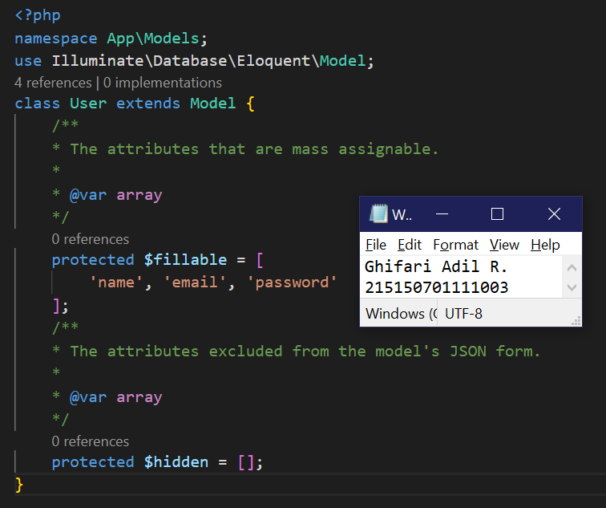
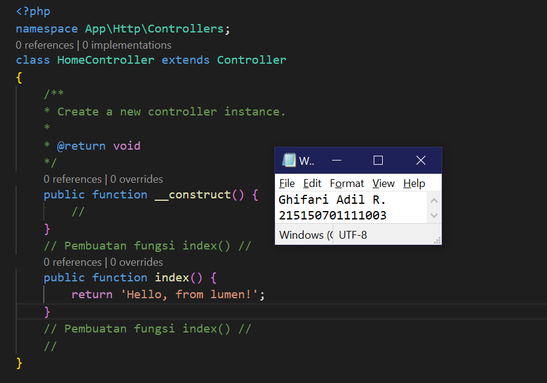
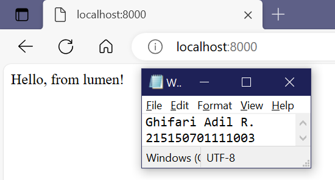

# **BAB 6: Model, Controller, dan Request-Response Handler**
**Oleh Ghifari Adil Ruchiyat - 215150701111003**

## Model

1. Pastikan terdapat tabel users yang dibuat menggunakan migration pada bab sebelumnya. Berikut informasi kolom yang harus ada

    * id
    * createdAt
    * updatedAt
    * name
    * email
    * password

    <p align="center">
       </img><br>
       <i>Gambar 1.1: Gambar kolom pada tabel user</i>
    </p>

2. Bersihkan isi `User.php` yang ada sebelumnya dan isi dengan baris kode berikut

    ```php
    <?php

    namespace App\Models;

    use Illuminate\Database\Eloquent\Model;

    class User extends Model
    {
        /**
         * The attributes that are mass assignable.
         *
         * @var array
         */
        protected $fillable = [
            'name', 'email', 'password'
        ];
        /**
         * The attributes excluded from the model's JSON form.
         *
         * @var array
         */
        protected $hidden = [];
    }
    ```

    <p align="center">
       </img><br>
       <i>Gambar 1.2: Mengubah model untuk user</i>
    </p>

---
## Controller
1. Buatlah salinan `ExampleController.php` pada folder `app/Http/Controllers` dengan nama `HomeController.php` dan buatlah fungsi `index()` yang berisi

    ```php
    <?php

    namespace App\Http\Controllers;

    class HomeController extends Controller
    {
        /**
         * Create a new controller instance.
         *
         * @return void
         */
        public function __construct()
        {
            //
        }

        // Pembuatan fungsi index() //
        public function index()
        {
            return 'Hello, from lumen!';
        }
        // Pembuatan fungsi index() //

        //
    }
    ```

    <p align="center">
       </img><br>
       <i>Gambar 2.1: Membuat controller baru bernama HomeController</i>
    </p>

2. Ubah route / pada file `routes/web.php` menjadi seperti ini

    ```php
    # Sebelum,
    $router->get('/', function () use ($router) {
        return $router->app->version();
    });
    # Setelah,
    $router->get('/', ['uses' => 'HomeController@index']);
    ```

    <p align="center">
       </img><br>
       <i>Gambar 2.2: Mengganti route untuk endpoint <code>/</code> sehingga menggunakan HomeController</i>
    </p>

3. Jalankan aplikasi

    <p align="center">
       </img><br>
       <i>Gambar 2.3: Menjalankan aplikasi lumenapi</i>
    </p>

---