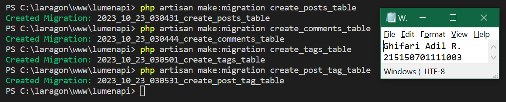
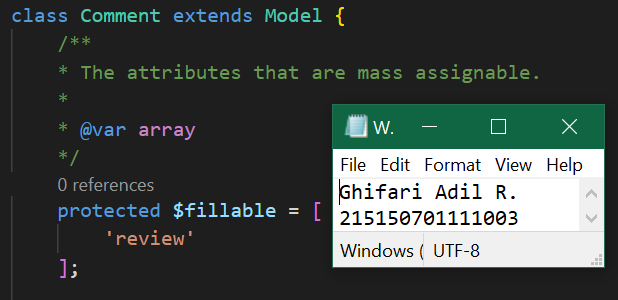

# **BAB 7: Relasi One-to-Many dan Many-to-Many**
**Oleh Ghifari Adil Ruchiyat - 215150701111003**

## Pembuatan Tabel
Berikut adalah tabel yang akan digunakan pada percobaan ini

| posts             | comments        | tags | post_tag |
|-------------------|-----------------|------|----------|
| id                | id              | id   | postId   |
| content (STRING)  | review (STRING) | name | tagId    |

1. Sebelum membuat migrasi database atau membuat tabel pastikan server database aktif kemudian pastikan sudah membuat database dengan nama `lumenpost`

    <p align="center">
       </img><br>
       <i>Gambar 1.1: Membuat database <code>lumenpost</code> </i>
    </p>

2. Kemudian ubah konfigurasi database pada file .env menjadi seperti berikut

    ```
    DB_CONNECTION=mysql
    DB_HOST=127.0.0.1
    DB_PORT=3306
    DB_DATABASE=lumenpost
    DB_USERNAME=root
    DB_PASSWORD=
    ```

    <p align="center">
       </img><br>
       <i>Gambar 1.2: Mengubah konfigurasi pada file <code>.env</code> </i>
    </p>

3. Setelah mengubah konfigurasi pada file .env, kita juga perlu menghidupkan beberapa library bawaan dari lumen dengan membuka file app.php pada folder bootstrap dan mengubah baris ini

    ```php
    // $app->withFacades();
    // $app->withEloquent();
    ```

    menjadi

    ```php
    $app->withFacades();
    $app->withEloquent();
    ```

    <p align="center">
       </img><br>
       <i>Gambar 1.3: Menghidupkan library Facades dan Eloquent</i>
    </p>

4. Setelah itu jalankan command berikut untuk membuat file migration

    ```
    php artisan make:migration create_posts_table
    php artisan make:migration create_comments_table
    php artisan make:migration create_tags_table
    php artisan make:migration create_post_tag_table
    ```

    <p align="center">
       </img><br>
       <i>Gambar 1.4: Membuat file migration</i>
    </p>

5. Ubah fungsi `up()` pada file migrasi `create_posts_table`

    ```php
    #sebelumnya
    ...
    public function up()
    {
        Schema::create('posts', function (Blueprint $table) {
            $table->id();
            $table->timestamps();
        });
    }
    ...

    #diubah menjadi
    ...
    public function up()
    {
        Schema::create('posts', function (Blueprint $table) {
            $table->id();
            $table->timestamps();
            $table->string('content');
        });
    }
    ...
    ```

    <p align="center">
       </img><br>
       <i>Gambar 1.5: Mengubah isi file migration <code>create_posts_table</code> </i>
    </p>

6. Ubah fungsi `up()` pada file `create_comments_table`

    ```php
    #sebelumnya
    ...
    public function up()
    {
        Schema::create('comments', function (Blueprint $table) {
            $table->id();
            $table->timestamps();
        });
    }
    ...

    #diubah menjadi
    ...
    public function up()
    {
        Schema::create('comments', function (Blueprint $table) {
            $table->id();
            $table->timestamps();
            $table->string('review');
            $table->foreignId('postId')->unsigned();
        });
    }
    ...
    ```

    <p align="center">
       </img><br>
       <i>Gambar 1.6: Mengubah isi file migration <code>create_comments_table</code> </i>
    </p>

7. Ubah fungsi `up()` pada file `create_tags_table`

    ```php
    #sebelumnya
    ...
    public function up()
    {
        Schema::create('tags', function (Blueprint $table) {
            $table->id();
            $table->timestamps();
        });
    }
    ...

    #diubah menjadi
    ...
    public function up()
    {
        Schema::create('tags', function (Blueprint $table) {
            $table->id();
            $table->timestamps();
            $table->string('name');
        });
    }
    ...
    ```

    <p align="center">
       </img><br>
       <i>Gambar 1.7: Mengubah isi file migration <code>create_tags_table</code> </i>
    </p>

8. Ubah fungsi `up()` pada file `create_post_tag_table`

    ```php
    #sebelumnya
    ...
    public function up()
    {
        Schema::create('post_tag', function (Blueprint $table) {
            $table->id();
            $table->timestamps();
        });
    }
    ...

    #diubah menjadi
    ...
    public function up()
    {
        Schema::create('post_tag', function (Blueprint $table) {
            $table->id();
            $table->timestamps();
            $table->foreignId('postId')->unsigned();
            $table->foreignId('tagId')->unsigned();
        });
    }
    ...
    ```

    <p align="center">
       </img><br>
       <i>Gambar 1.7: Mengubah isi file migration <code>create_post_tag_table</code> </i>
    </p>

9. Kemudian jalankan command

    ```
    php artisan migrate
    ```

    <p align="center">
       </img><br>
       <i>Gambar 1.9: Melakukan migrasi tabel ke database</i>
    </p>

---
## Pembuatan Model
1. Buatlah file dengan nama Post.php dan isi dengan baris kode berikut

    ```php
    <?php

    namespace App\Models;

    use Illuminate\Database\Eloquent\Model;

    class Post extends Model
    {
        /**
         * The attributes that are mass assignable.
         *
         * @var string[]
         */
        protected $fillable = [
            'content'
        ];

        /**
         * The attributes excluded from the model's JSON form.
         *
         * @var string[]
         */
        protected $hidden = [];
    }
    ```

    <p align="center">
       </img><br>
       <i>Gambar 2.1: Membuat model untuk post</i>
    </p>

2. Buatlah file dengan nama Comment.php dan isi dengan baris kode berikut

    ```php
    <?php

    namespace App\Models;

    use Illuminate\Database\Eloquent\Model;

    class Comment extends Model
    {
        /**
         * The attributes that are mass assignable.
         *
         * @var string[]
         */
        protected $fillable = [
            'review'
        ];
        
        /**
         * The attributes excluded from the model's JSON form.
         *
         * @var string[]
         */
        protected $hidden = [];
    }
    ```

    <p align="center">
       </img><br>
       <i>Gambar 2.2: Membuat model untuk comment</i>
    </p>

3. Buatlah file dengan nama Tag.php dan isi dengan baris kode berikut
    ```php
    <?php

    namespace App\Models;

    use Illuminate\Database\Eloquent\Model;

    class Tag extends Model
    {
        /**
         * The attributes that are mass assignable.
         *
         * @var string[]
         */
        protected $fillable = [
            'name'
        ];
        
        /**
         * The attributes excluded from the model's JSON form.
         *
         * @var string[]
         */
        protected $hidden = [];
    }
    ```

    <p align="center">
       </img><br>
       <i>Gambar 2.3: Membuat model untuk tag</i>
    </p>

---
## Relasi One-to-Many

1. Tambahkan fungsi `comments()` pada file Post.php
    ```php
    <?php

    namespace App\Models;

    use Illuminate\Database\Eloquent\Model;

    class Post extends Model
    {
    ...

        // fungsi comments
        public function comments()
        {
            return $this->hasMany(Comment::class, 'postId');
        }
    }
    ```

    <p align="center">
       </img><br>
       <i>Gambar 3.1: Menambahkan fungsi <code>comments()</code> pada file Post.php</i>
    </p>

2. Tambahkan fungsi `post()` dan atribut `postId` pada `$fillable` pada file Comment.php
    ```php
    <?php

    namespace App\Models;

    use Illuminate\Database\Eloquent\Model;

    class Comment extends Model
    {
        ...

        protected $fillable = [
            'review',
            'postId' // atribut postId
        ];

        /**
         * The attributes excluded from the model's JSON form.
         *
         * @var string[]
         */
        protected $hidden = [];

        public function post()
        {
            return $this->belongsTo(Post::class, 'postId');
        }
    }
    ```

    <p align="center">
       </img><br>
       <i>Gambar 3.2: Menambahkan fungsi <code>post()</code> dan atribut pada <code>$fillable</code> pada file Comment.php</i>
    </p>

3. Buatlah file PostController.php dan isilah dengan baris kode berikut
    ```php
    <?php

    namespace App\Http\Controllers;

    use App\Models\Post;
    use Illuminate\Http\Request;

    class PostController extends Controller
    {
        /**
         * Create a new controller instance.
         *
         * @return void
         */
        public function __construct()
        {
            //
        }

        //
        public function createPost(Request $request)
        {
            $post = Post::create([
                'content' => $request->content,
            ]);

            return response()->json([
                'success' => true,
                'message' => 'New post created',
                'data' => [
                    'post' => $post
                ]
            ]);
        }

        public function getPostById(Request $request)
        {
            $post = Post::find($request->id);

            return response()->json([
                'success' => true,
                'message' => 'All post grabbed',
                'data' => [
                    'post' => [
                        'id' => $post->id,
                        'content' => $post->content,
                        'comments' => $post->comments,
                    ]
                ]
            ]);
        }
    }
    ```

    <p align="center">
       </img><br>
       <i>Gambar 3.3: Membuat file PostController.php</i>
    </p>

4. Buatlah file CommentController.php dan isilah dengan baris kode berikut
    ```php
    <?php

    namespace App\Http\Controllers;

    use App\Models\Comment;
    use Illuminate\Http\Request;

    class CommentController extends Controller
    {
        /**
         * Create a new controller instance.
         *
         * @return void
         */
        public function __construct()
        {
            //
        }

        //
        public function createComment(Request $request)
        {
            $comment = Comment::create([
                'review' => $request->review,
                'postId' => $request->postId,
            ]);

            return response()->json([
                'success' => true,
                'message' => 'New comment created',
                'data' => [
                    'comment' => $comment
                ]
            ]);
        }
    }
    ```

    <p align="center">
       </img><br>
       <i>Gambar 3.4: Membuat file CommentController.php</i>
    </p>

5. Tambahkan baris berikut pada routes/web.php
    ```php
    <?php

    ...
    
    $router->group(['prefix' => 'posts'], function () use ($router) {
        $router->post('/', ['uses' => 'PostController@createPost']);
        $router->get('/{id}', ['uses' => 'PostController@getPostById']);
    });

    $router->group(['prefix' => 'comments'], function () use ($router) {
        $router->post('/', ['uses' => 'CommentController@createComment']);
    });
    ```

    <p align="center">
       </img><br>
       <i>Gambar 3.5: Menambahkan route untuk post dan comment</i>
    </p>

6. Buatlah satu post menggunakan Postman

    <p align="center">
       </img><br>
       <i>Gambar 3.6: Menambahkan post baru menggunakan thunder client</i>
    </p>

7. Buatlah satu comment menggunakan Postman

    <p align="center">
       </img><br>
       <i>Gambar 3.7: Menambahkan comment baru menggunakan thunder client</i>
    </p>

8. Tampilkan post menggunakan Postman

    <p align="center">
       </img><br>
       <i>Gambar 3.8: Menampilkan post dan comment yang sudah dibuat</i>
    </p>