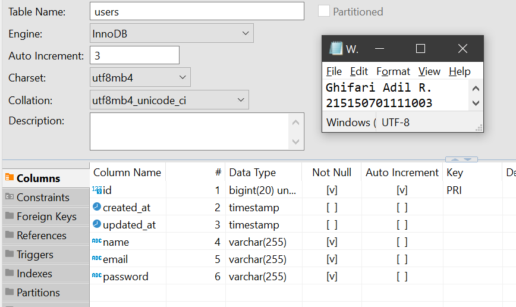
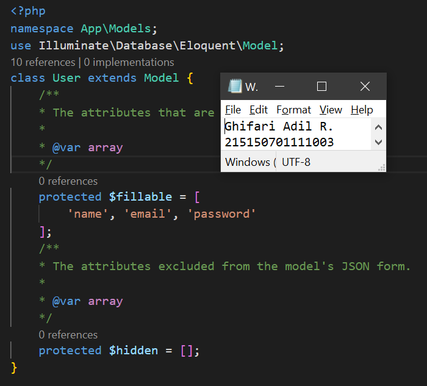
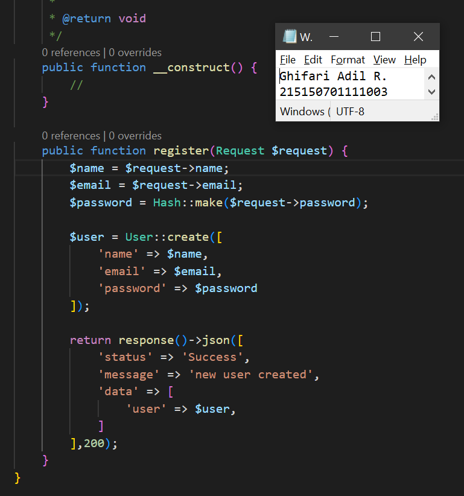
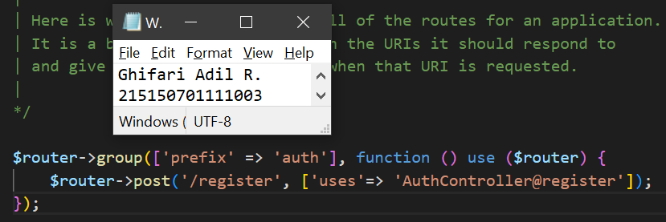
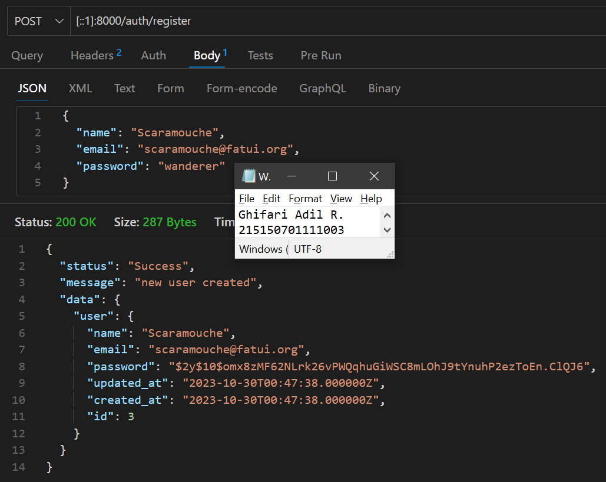

# **BAB 8: Register, Authentication dan Authorization**
**Oleh Ghifari Adil Ruchiyat - 215150701111003**

## Register
1. Pastikan terdapat tabel users yang dibuat menggunakan migration pada bab 3 Basic Routing dan Migration. Berikut informasi kolom yang harus ada:

    |              |
    |-----|
    | id                |
    | createdAt  |
    | updatedAt  |
    | name  |
    | email  |
    | password  |

    <p align="center">
       </img><br>
       <i>Gambar 1.1: Tabel users dan kolomnya</i>
    </p>

2. Pastikan terdapat model User.php yang digunakan pada bab 5 Model, Controller dan Request-Response Handler. Berikut baris kode yang harus ada:

    ```php
    <?php

    namespace App\Models;

    use Illuminate\Database\Eloquent\Model;

    class User extends Model
    {
        /**
         * The attributes that are mass assignable.
         *
         * @var array
         */
        protected $fillable = [
            'name', 'email', 'password'
        ];
        
        /**
         * The attributes excluded from the model's JSON form.
         *
         * @var array
         */
        protected $hidden = [];
    }
    ```

    <p align="center">
       </img><br>
       <i>Gambar 1.2: Kode dari model user</i>
    </p>

3. Buatlah file AuthController.php dan isilah dengan baris kode berikut
    ```php
    <?php

    namespace App\Http\Controllers;

    use App\Models\User;
    use Illuminate\Http\Request;
    use Illuminate\Support\Facades\Hash;

    class AuthController extends Controller
    {
        /**
         * Create a new controller instance.
         *
         * @return void
         */
        public function __construct()
        {
            //
        }

        //
        public function register(Request $request)
        {
            $name = $request->name;
            $email = $request->email;
            $password = Hash::make($request->password);

            $user = User::create([
                'name' => $name,
                'email' => $email,
                'password' => $password
            ]);

            return response()->json([
                'status' => 'Success',
                'message' => 'new user created',
                'data' => [
                    'user' => $user,
                ]
            ],200);
        }
    }
    ```

    <p align="center">
       </img><br>
       <i>Gambar 1.3: Membuat controller baru bernama <code>AuthController.php</code> </i>
    </p>

4. Tambahkan baris berikut pada routes/web.php

    ```php
    <?php

    ...

    $router->group(['prefix' => 'auth'], function () use ($router) {
        $router->post('/register', ['uses'=> 'AuthController@register']);
    });
    ```

    <p align="center">
       </img><br>
       <i>Gambar 1.4: Membuat endpoint baru untuk registrasi</i>
    </p>

5. Jalankan aplikasi pada endpoint /auth/register dengan body berikut

    ```JSON
    {
        "name": "Scaramouche",
        "email": "scaramouche@fatui.org",
        "password": "wanderer"
    }
    ```

    <p align="center">
       </img><br>
       <i>Gambar 1.5: Melakukan registrasi user baru dengan endpoint <code>/auth/register</code> </i>
    </p>