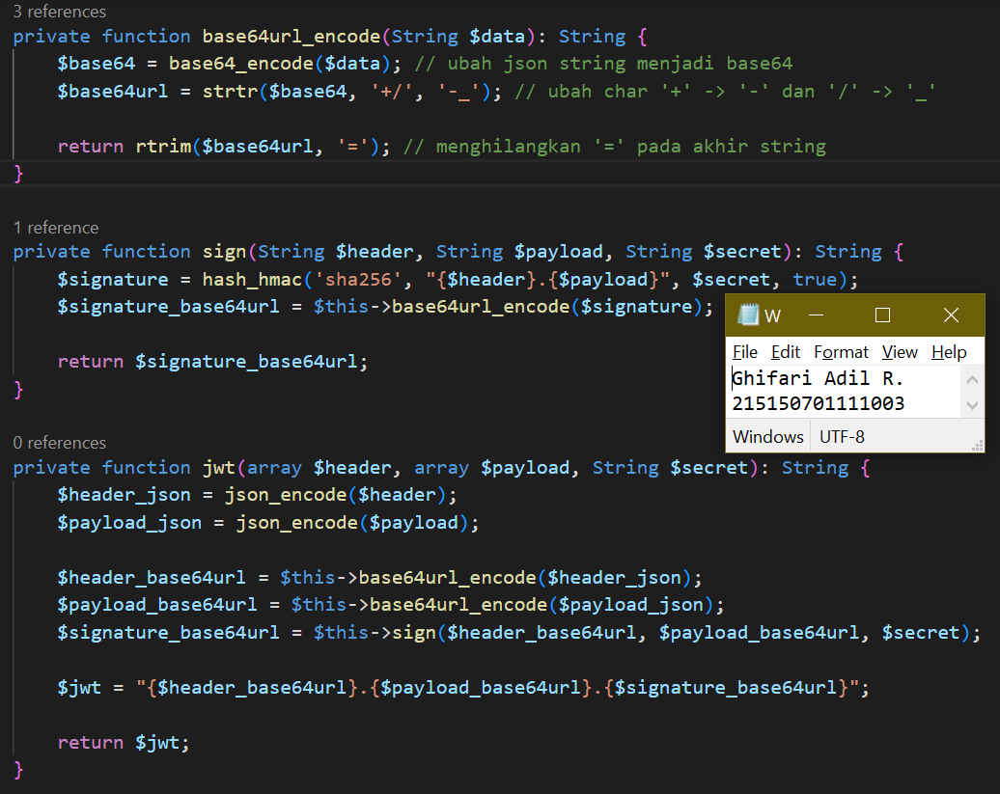
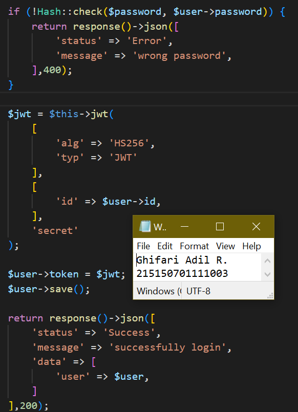
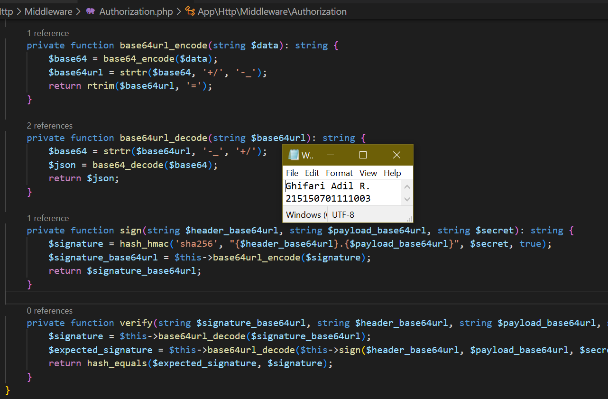
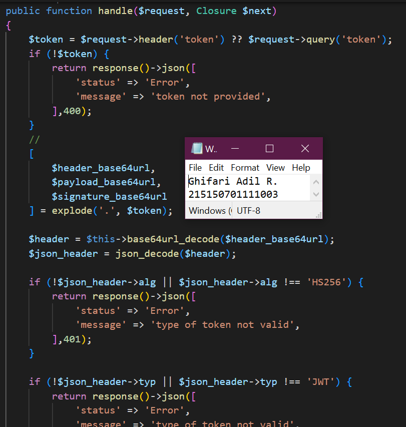
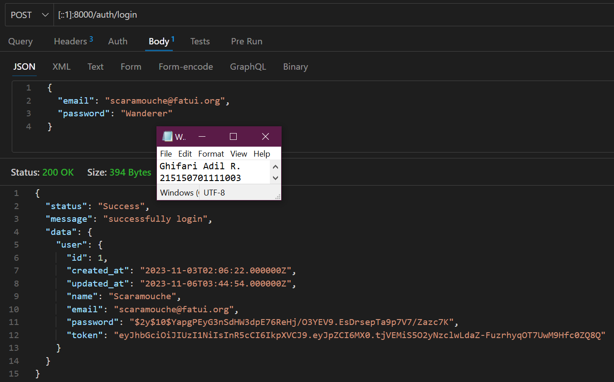
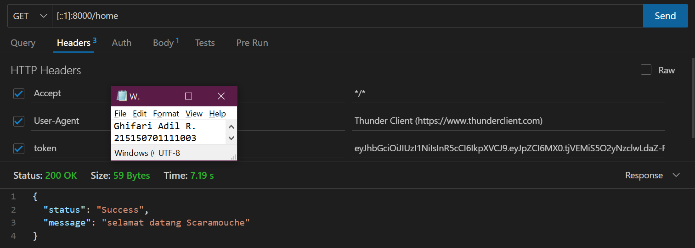

# **Bab 9: JSON Web Token (JWT)**
**Oleh Ghifari Adil Ruchiyat - 215150701111003**

## Penyesuaian Database
1. Lakukan perubahan pada length kolom token dengan menghapus parameter 72 di belakangnya

    ```php
    <?php

    use Illuminate\Database\Migrations\Migration;
    use Illuminate\Database\Schema\Blueprint;
    use Illuminate\Support\Facades\Schema;

    class AddColumnTokenToUsers extends Migration
    {
        /**
         * Run the migrations.
         *
         * @return void
         */
        // from this
        public function up()
        {
            Schema::table('users', function (Blueprint $table) {
            $table->string('token', 72)->unique()->nullable(); //
            });
        }

        // to this
        public function up()
        {
            Schema::table('users', function (Blueprint $table) {
            $table->string('token')->unique()->nullable();
            });
        }
        
        ...
    }
    ```

    <p align="center">
       </img><br>
       <i>Gambar 1.1: Menyesuaikan database agar dapat menggunakan JWT</i>
    </p>

2. Jalankan perintah di bawah untuk memperbaharui migrasi dan menghapus data yang lama

    ```
    php artisan migrate:fresh
    ```

    <p align="center">
       </img><br>
       <i>Gambar 1.2: Memperbaharui migrasi database</i>
    </p>

3. Jalankan aplikasi pada endpoint `/auth/register` dengan body berikut.

    ```JSON
    {
        "name": "Scaramouche",
        "email": "scaramouche@fatui.org",
        "password": "wanderer"
    }
    ```

    <p align="center">
       </img><br>
       <i>Gambar 1.3: Melakukan registrasi user baru</i>
    </p>

---
## JWT Manual
1. Tambahkan ketiga fungsi berikut pada AuthController.php

    ```php
    <?php

    namespace App\Http\Controllers;

    use App\Models\User;
    use Illuminate\Http\Request;
    use Illuminate\Support\Facades\Hash;
    use Illuminate\Support\Str;

    class AuthController extends Controller
    {
        ...

        private function base64url_encode(String $data): String
        {
            $base64 = base64_encode($data); // ubah json string menjadi base64
            $base64url = strtr($base64, '+/', '-_'); // ubah char '+' -> '-' dan '/' -> '_'

            return rtrim($base64url, '='); // menghilangkan '=' pada akhir string
        }

        private function sign(String $header, String $payload, String $secret): String
        {
            $signature = hash_hmac('sha256', "{$header}.{$payload}", $secret, true);
            $signature_base64url = $this->base64url_encode($signature);

            return $signature_base64url;
        }

        private function jwt(array $header, array $payload, String $secret): String
        {
            $header_json = json_encode($header);
            $payload_json = json_encode($payload);

            $header_base64url = $this->base64url_encode($header_json);
            $payload_base64url = $this->base64url_encode($payload_json);
            $signature_base64url = $this->sign($header_base64url, $payload_base64url, $secret);

            $jwt = "{$header_base64url}.{$payload_base64url}.{$signature_base64url}";
            
            return $jwt;
        }
    }
    ```

    <p align="center">
       </img><br>
       <i>Gambar 2.1: Menambahkan fungsi baru pada controller untuk membuat token</i>
    </p>

2. Lakukan perubahan pada fungsi login

    ```php
    <?php

    namespace App\Http\Controllers;

    use App\Models\User;
    use Illuminate\Http\Request;
    use Illuminate\Support\Facades\Hash;
    use Illuminate\Support\Str;

    class AuthController extends Controller
    {
        ...

        public function login(Request $request)
        {
            $email = $request->email;
            $password = $request->password;

            $user = User::where('email', $email)->first();

            if (!$user) {
                return response()->json([
                    'status' => 'Error',
                    'message' => 'user not exist',
                ],404);
            }

            if (!Hash::check($password, $user->password)) {
                return response()->json([
                    'status' => 'Error',
                    'message' => 'wrong password',
                ],400);
            }

            //
            $jwt = $this->jwt(
                [
                    'alg' => 'HS256',
                    'typ' => 'JWT'
                ],
                [
                    'id' => $user->id,
                ],
                'secret'
            );

            $user->token = $jwt;
            //
            $user->save();

            return response()->json([
                'status' => 'Success',
                'message' => 'successfully login',
                'data' => [
                    'user' => $user,
                ]
            ],200);
        }

        ...
    }
    ```

    <p align="center">
       </img><br>
       <i>Gambar 2.2: Mengubah fungsi login pada AuthController agar menggunakan JWT</i>
    </p>

3. Tambahkan keempat fungsi berikut pada Middleware/Authorization.php

    ```php
    <?php

    namespace App\Http\Middleware;

    use App\Models\User;
    use Closure;

    class Authorization
    {
        ...

        private function base64url_encode(string $data): string
        {
            $base64 = base64_encode($data);
            $base64url = strtr($base64, '+/', '-_');

            return rtrim($base64url, '=');
        }

        private function base64url_decode(string $base64url): string
        {
            $base64 = strtr($base64url, '-_', '+/');
            $json = base64_decode($base64);

            return $json;
        }

        private function sign(string $header_base64url, string $payload_base64url, string $secret): string
        {
            $signature = hash_hmac('sha256', "{$header_base64url}.{$payload_base64url}", $secret, true);
            $signature_base64url = $this->base64url_encode($signature);

            return $signature_base64url;
        }

        private function verify(string $signature_base64url, string $header_base64url, string $payload_base64url, string $secret): bool
        {
            $signature = $this->base64url_decode($signature_base64url);
            $expected_signature = $this->base64url_decode($this->sign($header_base64url, $payload_base64url, $secret));
            
            return hash_equals($expected_signature, $signature);
        }
    }
    ```

    <p align="center">
       </img><br>
       <i>Gambar 2.3: Menambahkan fungsi pada middleware Authorization agar menggunakan JWT</i>
    </p>

4. Lakukan perubahan pada fungsi handle

    ```php
    <?php

    namespace App\Http\Middleware;

    use App\Models\User;
    use Closure;

    class Authorization
    {
        /**
         * Handle an incoming request.
         *
         * @param \Illuminate\Http\Request $request
         * @param \Closure $next
         * @return mixed
         */
        public function handle($request, Closure $next)
        {
            $token = $request->header('token') ?? $request->query('token');
            if (!$token) {
                return response()->json([
                    'status' => 'Error',
                    'message' => 'token not provided',
                ],400);
            }

            //
            [
                $header_base64url,
                $payload_base64url,
                $signature_base64url
            ] = explode('.', $token);

            $header = $this->base64url_decode($header_base64url);
            $json_header = json_decode($header);

            if (!$json_header->alg || $json_header->alg !== 'HS256') {
                return response()->json([
                    'status' => 'Error',
                    'message' => 'type of token not valid',
                ],401);
            }

            if (!$json_header->typ || $json_header->typ !== 'JWT') {
                return response()->json([
                    'status' => 'Error',
                    'message' => 'type of token not valid',
                ],401);
            }

            $payload = $this->base64url_decode($payload_base64url);
            $json_payload = json_decode($payload);
            if (!$json_payload->id) {
                return response()->json([
                    'status' => 'Error',
                    'message' => 'invalid token',
                ],400);
            }

            $verified = $this->verify($signature_base64url, $header_base64url, $payload_base64url, 'secret');
                if (!$verified) {
                return response()->json([
                    'status' => 'Error',
                    'message' => 'invalid sign token',
                ],400);
            }
            $id = $json_payload->id;
            $user = User::where('id', $id)->first();
            //
            if (!$user) {
                return response()->json([
                    'status' => 'Error',
                    'message' => 'invalid token',
                ],400);
            }
            $request->user = $user;
            return $next($request);
        }
        ...
    }
    ```

    <p align="center">
       </img><br>
       <i>Gambar 2.4: Mengubah fungsi handle pada middleware Authorization agar menggunakan JWT</i>
    </p>

5. Jalankan aplikasi pada endpoint `/auth/login` dengan body berikut. Salinlah token yang didapat ke notepad

    ```json
    {
        "email": "scaramouche@fatui.org",
        "password": "wanderer"
    }
    ```

    <p align="center">
       </img><br>
       <i>Gambar 2.5: Melakukan login dan mendapatkan token</i>
    </p>

6. Jalankan aplikasi pada endpoint /home dengan melampirkan nilai token yang didapat setelah login pada header

    <p align="center">
       </img><br>
       <i>Gambar 2.6: Masuk ke endpoint home dengan menggunakan JWT</i>
    </p>