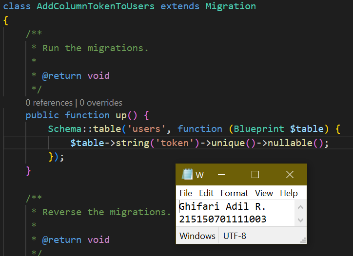
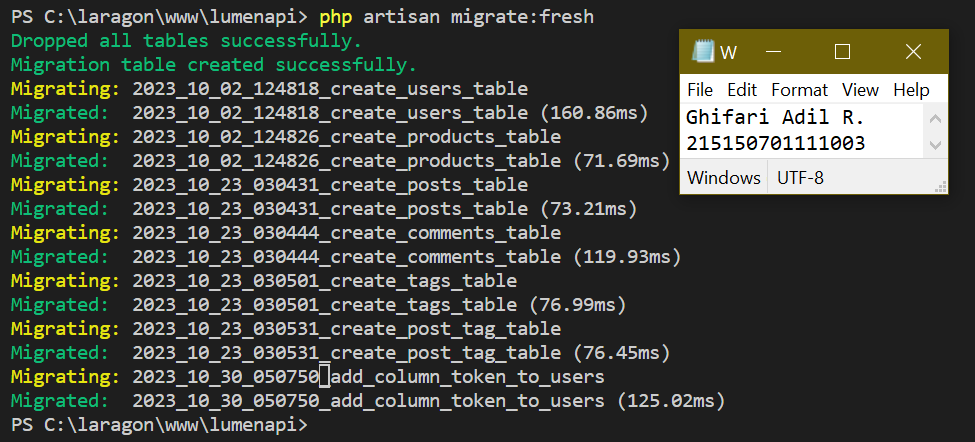
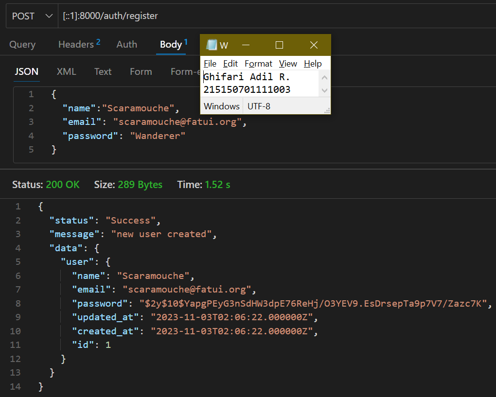

# **Bab 9: JSON Web Token (JWT)**
**Oleh Ghifari Adil Ruchiyat - 215150701111003**

## Penyesuaian Database
1. Lakukan perubahan pada length kolom token dengan menghapus parameter 72 di belakangnya
    ```php
    <?php

    use Illuminate\Database\Migrations\Migration;
    use Illuminate\Database\Schema\Blueprint;
    use Illuminate\Support\Facades\Schema;

    class AddColumnTokenToUsers extends Migration
    {
        /**
         * Run the migrations.
         *
         * @return void
         */
        // from this
        public function up()
        {
            Schema::table('users', function (Blueprint $table) {
            $table->string('token', 72)->unique()->nullable(); //
            });
        }

        // to this
        public function up()
        {
            Schema::table('users', function (Blueprint $table) {
            $table->string('token')->unique()->nullable();
            });
        }
        
        ...
    }
    ```

    <p align="center">
       </img><br>
       <i>Gambar 1.1: Menyesuaikan database agar dapat menggunakan JWT</i>
    </p>

2. Jalankan perintah di bawah untuk memperbaharui migrasi dan menghapus data yang lama

    ```
    php artisan migrate:fresh
    ```

    <p align="center">
       </img><br>
       <i>Gambar 1.2: Memperbaharui migrasi database</i>
    </p>

3. Jalankan aplikasi pada endpoint `/auth/register` dengan body berikut.

    ```JSON
    {
        "name": "Scaramouche",
        "email": "scaramouche@fatui.org",
        "password": "wanderer"
    }
    ```

    <p align="center">
       </img><br>
       <i>Gambar 1.3: Melakukan registrasi user baru</i>
    </p>